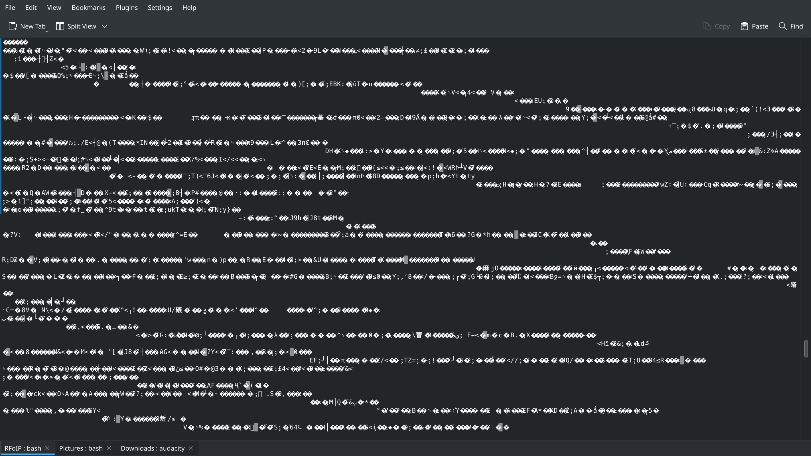

The challenge first give you a TCP socket to connect to it 

```bash
nc rfoip-620ac7b1.radio.2025.irisc.tf 6531
```

When you connect to the socket, You only get a stream of byte :




At that point, i instantly figured it was probably byte coming from an audio source. So I transfered the byte to a file :

```bash
nc rfoip-620ac7b1.radio.2025.irisc.tf 6531 >> frequency
```

Then, I opened Audacity to hear the message.

The message was only white noise I couldn't hear anything.

I played with the settings of audacity and saw that i can use filters. 

First, I imported the file with an encoding of 32 bits and in 2 channel (stereo) mode so i could separate sounds throught each extremity of my headphones.


The sound is now better. But, i still need to get rid of most of the white noise. So, i've use audacity EQ filters

First, Select all the audio and then use this route : Effect -> EQ and Filters -> Filter Curse EQ -> Preset & Settings -> Factory Presets

Finally, i've boost the audio in my left extremity and mute the right extremity. I could now hear clearly the woman telling me the flag. 

irisctf{welcome_to_iris_radio_enjoy_surfing_the_waves} 
