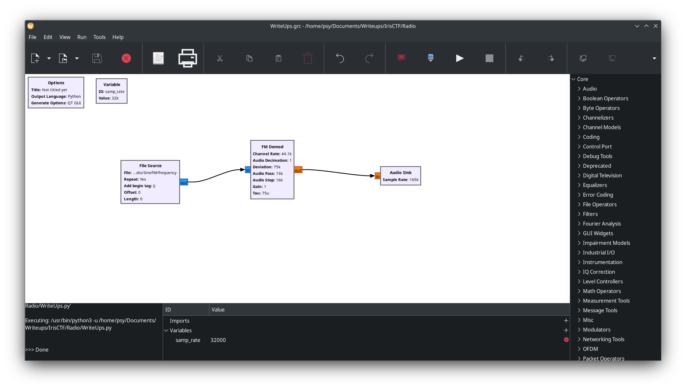

This challenge is about the same as RfoIP. Except, I couldn't find anything for FM signal on audacity. 

RFoIP used AM signal

SineFM now use FM signal

Let's do the same as RFoIP and create a file from the TCP Socket and continue with the writeup

```bash
nc sinefm-f94347f3.radio.2025.irisc.tf 6531 >> frequency
```

Based on my learning of radio frequency hacking, there's multiple tool that can be used for playing with radio frequency 

This is why I present to you GNURadio-Companion ! 

GNU Radio Companion (GRC) is a graphical interface for designing software-defined radio (SDR) systems. It allows users to build radio applications by connecting signal processing blocks in a flowgraph. The flowgraph is then converted into Python code, which can control SDR hardware or simulate signal processing tasks. GRC simplifies SDR development by providing an intuitive, code-free environment, making it ideal for both beginners and experts in wireless communication and signal processing. 

Without further wait, here's my graph :



First, We give GRC a File Source whish is going to contains the frequency file

We then link the File Source to a FM Demodulator and then link the FM Demodulator to an audio sink 

Audio Sink = my headphones

I've put the Channel Rate of the FM Demod to 44100k, the same of audacity

At first, the audio we hear is really slow, so we need to change the sample rate of the audio sink to 165k

Then, we can finally hear the man telling us the flag


irisctf{grc_is_great_for_simple_narrowband_modulation}
