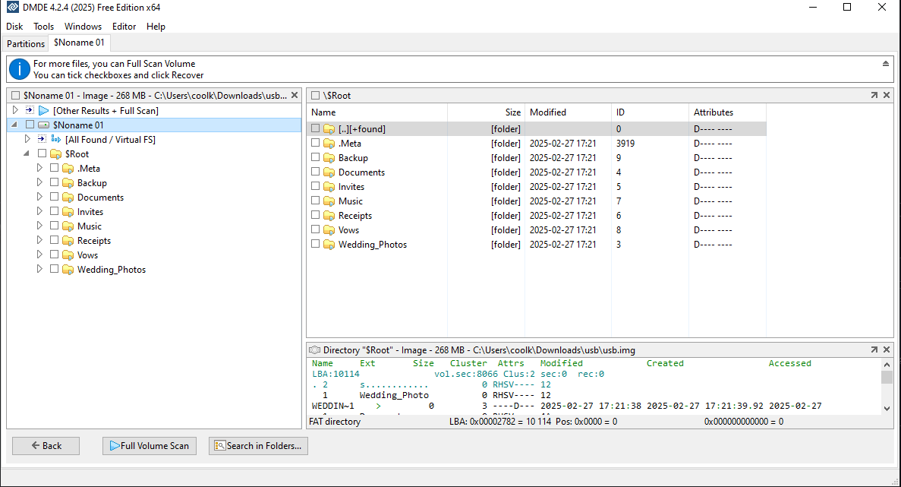

__MetaCTF Febuary 2025 - "Till Delete Do Us Part" Writeup__
---

__Challenge Description__ 
---
I was messing with trying to dual boot, and while trying to fix partitions, I accidentally deleted the one on my wedding flash drive I carelessly had plugged in! Please help me recover it! 
---
In this challenge, we are tasked to download a corrupted iso partition file and try and recover the data that is lost. 

__Step 1: Download a notable data recovery software to try and repair the corrupted file.__
For this challenge in particular, DMDE (Disk Editor and Data Recovery Software) was used. 

__Step 2: Open the usb file on DMDE.__
If you do the recovery correctly, there should be a new img file that appears that's called usb.1. You click this file aswell and it should open up to this structure: 

After you get this structure, we click the "$noname" file and we see this: 

From here, we click the ".Meta" file and if you look closely, there's a pattern of files that go down this file path. 

As you go down the path, the string `MetaCTF{n0t_ev3n_d3l3t10n_c4n_s3part3_u5)` is revealed. 

__Thanks for reading!__
