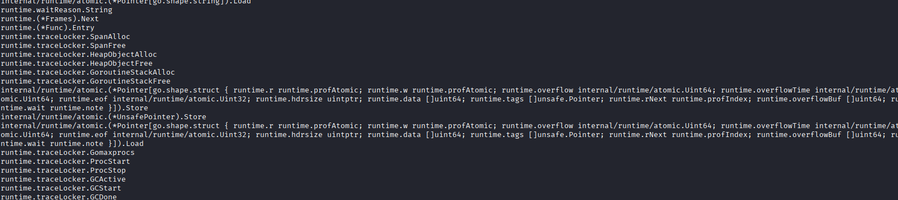

## Challenge
```text
gorevgohome
points : 494
Challenge creator : @gehaxelt
Description : Prove you can rev or go home.
Hint : docker run -it -v .:/app alpine:latest /bin/sh
```

## Solution

Downloading the binary, the first thing I’ve done is run `strings` on it. With that, we can instantly see it’s a Go binary based on all the runtime strings popping in the terminal.



After that, I tried to run the binary but was met with an error that a file wasn’t found. Then, I opened Ghidra and was met with tons of functions that I didn’t understand. Since the binary wasn’t possible to debug, I decided to go see Rusty Flag and came back when the Docker hint came out.

`docker run -it -v .:/app alpine:latest /bin/sh`

We understand from the hint that the binary needs to be run in an Alpine Docker container, so I’ve pulled the Alpine image and ran it with privileges

```shell
docker pull alpine
docker run --privileged -it -v .:/app alpine:latest /bin/sh
```

Now, being in the container, I first tried to run the binary and saw that it ran. We can now start debugging the binary properly, so I’ve started by adding tools to the Docker container:

```shell
apk add strace
apk add ltrace
apk add gdb
```

(Spoiler: gdb wasn’t useful in the end.)

I started with `strace` and saw that the binary was preventing `strace` from continuing by opening `/proc/self/status` in the file system. (That’s weird; I’ve never seen this type of anti-debug before.) Basically, the binary is checking the file for the `TracerPid` field to see if it’s being traced by another program (thank you ChatGPT)  
![[Pasted image 20250910195641.png]]

Now this is where the fun begins; the next thing I did was running `ltrace` on the binary and we are met with this output:

![[images/Pasted image 20250910195825.png]]

This output is normal because the binary is not dynamically linked, but my brain, being hurt and tired from Rusty Flag, decided to `cat` `/proc/<PID>/exe`. I was expecting to see the Go binary again but was met with a smaller binary.

![[images/Pasted image 20250910200545.png]]

In this small binary, we could see the strings of the checker being used:

```text
-> Give me the secret:
-> well done
```

Interesting, why would the binary be smaller? (After the CTF, I’ve learned that the Go binary was a loader for other binaries.) That would mean that `/proc/<PID>/exe` is the final binary being loaded by the Go binary.

After that, I’ve transferred the binary to a file and transferred it out of the Docker container to pass it to Ghidra. Once I’m in Ghidra, I instantly started searching for the checker string and went to the specified function.

![[images/Pasted image 20250910201814.png]]

Once inside the function there’s only one thing catching my eye, and it’s those variables being XORed against four hex values:

![[Pasted image 20250910202150.png]]

Looking at the assembly, we can see three globals being in use:

![[images/Pasted image 20250910202513.png]]

```text
DAT_00403060
DAT_00403040
DAT_00403070
```

Looking at those variables, we can see that those are hex blobs. Here’s `DAT_00403040` as an example:

![[images/Pasted image 20250910202715.png]]

Based on all those values, I know that must be where the flag is hidden. With a snippet of the checker assembly code, the XOR keys, and the three hex blobs, we can build a script to decode the flag (thank you ChatGPT):

```python
import binascii

K0 = bytes.fromhex("ed 3f ac 6f 02 74 fe 2a 79 89 df a4 4a 07 dc 2d".replace(" ",""))
K1 = bytes.fromhex("fb 73 3b dd 46 9d e8 e4 74 b2 61 6c 6f f1 47 03".replace(" ",""))
T  = bytes.fromhex("a8 71 e3 14 50 47 a8 75 48 fa 80 e5 26 70 e8 54 88 2c 6b e9 77 f3 b7 a5 1a d6 3e 2a 1a bf 66 7e".replace(" ",""))

secret = bytes(a ^ b for a,b in zip(T, K0+K1))

print("Secret (hex):", secret.hex())
try:
    print("Secret (ascii):", secret.decode('utf-8'))
except Exception as e:
    print("Secret (ascii, repr):", repr(secret))
```

Flag: `ENO{R3V_1s_Alw4ys_P41n_And_FuN!}`
